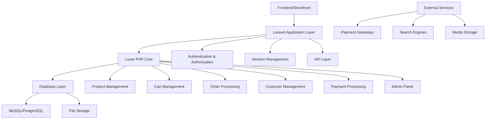
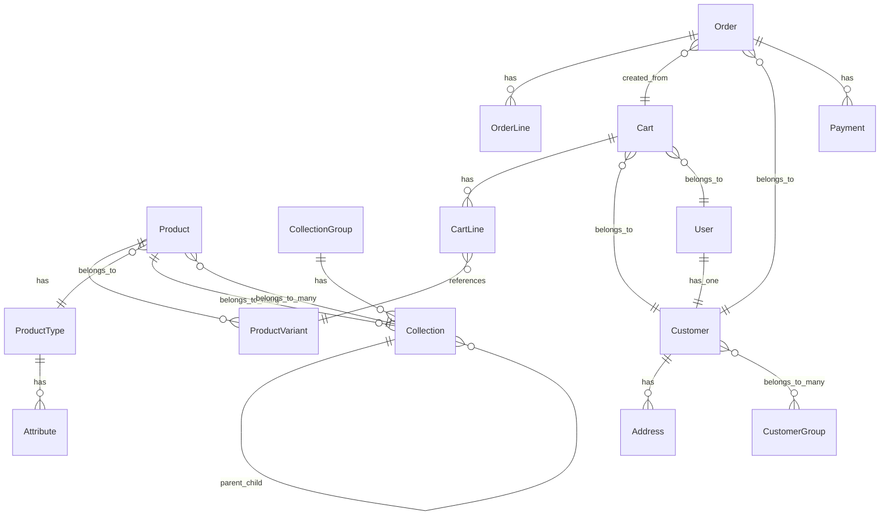

# Design Document: Lunar E-commerce System

## Overview

This design document outlines the implementation of a comprehensive e-commerce system using Lunar PHP within a Laravel application. The system will provide full e-commerce functionality including product catalog management, shopping cart operations, order processing, customer management, payment handling, and administrative features.

The implementation follows Lunar PHP's architecture patterns and leverages Laravel's ecosystem for a robust, scalable e-commerce solution.

## Architecture

### System Architecture

The Lunar e-commerce system follows a modular architecture with clear separation of concerns:



### Core Components

1. **Lunar Core**: The main e-commerce engine providing models, services, and business logic
2. **Admin Panel**: Administrative interface for managing the store
3. **Storefront Session**: Session management for cart and customer data
4. **Extension System**: Hooks and modifiers for customization

## Components and Interfaces

### Product Management Component

**Models:**
- `Product`: Main product entity with attributes and relationships
- `ProductVariant`: Product variations with SKU, pricing, and inventory
- `ProductType`: Product categorization with associated attributes
- `ProductOption`: Configurable options (color, size, etc.)
- `Collection`: Product groupings and categories with nested set hierarchy
- `CollectionGroup`: Organizational containers for collections

**Key Interfaces:**
```php
interface ProductRepositoryInterface
{
    public function create(array $data): Product;
    public function findWithVariants(int $id): Product;
    public function searchByAttributes(array $filters): Collection;
}

interface ProductVariantInterface
{
    public function updateStock(int $quantity): void;
    public function calculatePrice(Customer $customer = null): Money;
    public function isAvailable(): bool;
}

interface CollectionGroupInterface
{
    public function create(array $data): CollectionGroup;
    public function getCollections(CollectionGroup $group): Collection;
}

interface CollectionInterface
{
    public function create(array $data, CollectionGroup $group): Collection;
    public function addChild(Collection $parent, Collection $child): void;
    public function syncProducts(Collection $collection, array $products): void;
    public function sortProducts(Collection $collection, string $criteria): void;
}
```

### Cart Management Component

**Models:**
- `Cart`: Shopping cart container
- `CartLine`: Individual cart items
- `CartAddress`: Shipping and billing addresses
- `CartSession`: Session-based cart management

**Key Interfaces:**
```php
interface CartManagerInterface
{
    public function addItem(Purchasable $item, int $quantity): CartLine;
    public function removeItem(int $lineId): void;
    public function calculateTotals(): Cart;
    public function applyDiscount(string $couponCode): void;
}

interface CartSessionInterface
{
    public function current(): ?Cart;
    public function create(): Cart;
    public function associate(User $user): void;
}
```

### Order Processing Component

**Models:**
- `Order`: Completed purchase record with comprehensive order data
- `OrderLine`: Individual order items with purchasable references
- `OrderAddress`: Order shipping and billing addresses
- `Transaction`: Payment transaction records with gateway details

**Key Interfaces:**
```php
interface OrderProcessorInterface
{
    public function createFromCart(Cart $cart, bool $allowMultipleOrders = false, int $orderIdToUpdate = null): Order;
    public function updateStatus(Order $order, string $status): void;
    public function calculateShipping(Order $order): Money;
    public function validateCartForOrderCreation(Cart $cart): bool;
}

interface OrderReferenceGeneratorInterface
{
    public function generate(Order $order): string;
}

interface TransactionManagerInterface
{
    public function recordPayment(Order $order, array $paymentData): Transaction;
    public function processRefund(Transaction $transaction, Money $amount): Transaction;
    public function getOrderTransactions(Order $order): Collection;
}
```

### Customer Management Component

**Models:**
- `Customer`: Customer profile and preferences
- `CustomerGroup`: Customer segmentation
- `Address`: Customer addresses

**Key Interfaces:**
```php
interface CustomerManagerInterface
{
    public function create(array $data): Customer;
    public function addAddress(Customer $customer, array $addressData): Address;
    public function getOrderHistory(Customer $customer): Collection;
}
```

### Payment Processing Component

**Models:**
- `Payment`: Payment transaction records
- `PaymentIntent`: Payment processing intents
- `Transaction`: Individual transaction records

**Key Interfaces:**
```php
interface PaymentGatewayInterface
{
    public function createIntent(Order $order): PaymentIntent;
    public function processPayment(PaymentIntent $intent): Transaction;
    public function refund(Transaction $transaction, Money $amount): Transaction;
}
```

## Data Models

### Core Entity Relationships



### Database Schema Key Tables

**Products Table:**
- id, product_type_id, status, brand, created_at, updated_at
- Polymorphic attributes for flexible product data

**Product Variants Table:**
- id, product_id, sku, gtin, mpn, ean, unit_quantity, min_quantity, stock, backorder, purchasable, shippable

**Collection Groups Table:**
- id, name, handle, created_at, updated_at
- Handle auto-generated from name if not provided

**Collections Table:**
- id, collection_group_id, _lft, _rgt, parent_id, sort, created_at, updated_at
- Uses nested set model for hierarchical structure
- Polymorphic attributes for flexible collection data

**Collection Product Pivot Table:**
- collection_id, product_id, position
- Position field for custom sorting within collections

**Carts Table:**
- id, user_id, customer_id, merged_id, currency_id, channel_id, coupon_code, meta

**Orders Table:**
- id, user_id, customer_id, cart_id, channel_id, status, reference, customer_reference
- sub_total, discount_breakdown, discount_total, shipping_breakdown, shipping_total
- tax_breakdown, tax_total, total, notes, currency_code, compare_currency_code
- exchange_rate, placed_at, meta, created_at, updated_at

**Order Lines Table:**
- id, order_id, purchasable_type, purchasable_id, type, description, option
- identifier, unit_price, unit_quantity, quantity, sub_total, discount_total
- tax_breakdown, tax_total, total, notes, meta, created_at, updated_at

**Order Addresses Table:**
- id, order_id, country_id, title, first_name, last_name, company_name
- line_one, line_two, line_three, city, state, postcode, delivery_instructions
- contact_email, contact_phone, type, shipping_option, created_at, updated_at

**Transactions Table:**
- id, order_id, success, refund, driver, amount, reference, status
- notes, card_type, last_four, meta, created_at, updated_at

## Error Handling

### Exception Hierarchy

```php
abstract class LunarException extends Exception {}

class CartException extends LunarException {}
class OrderException extends LunarException {}
class PaymentException extends LunarException {}
class ProductException extends LunarException {}
class ValidationException extends LunarException {}
```

### Error Handling Strategy

1. **Validation Errors**: Use Laravel's validation system with custom rules
2. **Business Logic Errors**: Custom exceptions with meaningful messages
3. **Payment Errors**: Graceful handling with retry mechanisms
4. **Stock Errors**: Real-time inventory validation
5. **System Errors**: Comprehensive logging and monitoring

## Testing Strategy

### Dual Testing Approach

The system will use both unit testing and property-based testing to ensure comprehensive coverage:

**Unit Tests:**
- Test specific examples and edge cases
- Integration points between components
- Error conditions and exception handling
- Laravel feature tests for HTTP endpoints

**Property-Based Tests:**
- Universal properties across all inputs
- Business rule validation across random data
- Data integrity and consistency checks
- Performance characteristics under load

**Property-Based Testing Configuration:**
- Use **Pest PHP** with **Pest Property Testing** plugin for Laravel integration
- Minimum 100 iterations per property test
- Each test tagged with: **Feature: lunar-ecommerce-system, Property {number}: {property_text}**
- Focus on core business logic and data consistency properties

### Test Categories

1. **Model Tests**: Eloquent relationships, validation, business logic
2. **Service Tests**: Business service layer functionality
3. **Integration Tests**: Component interaction and data flow
4. **API Tests**: RESTful API endpoints and responses
5. **Feature Tests**: End-to-end user workflows

## Correctness Properties

*A property is a characteristic or behavior that should hold true across all valid executions of a system-essentially, a formal statement about what the system should do. Properties serve as the bridge between human-readable specifications and machine-verifiable correctness guarantees.*

### Property Reflection

After analyzing all acceptance criteria, I identified several areas where properties can be consolidated to eliminate redundancy and provide comprehensive validation:

- Product management properties can be combined to test overall product lifecycle consistency
- Cart operations can be unified to test cart state consistency across all operations
- Order processing properties can focus on order-cart data consistency
- Payment properties can be consolidated around transaction integrity
- Search and filtering can be combined into comprehensive search behavior validation

### Core System Properties

**Property 1: Product Creation Consistency**
*For any* valid product data with attributes and media, creating a product should result in a retrievable product with all specified attributes and media associations intact
**Validates: Requirements 2.1, 2.4, 2.5**

**Property 2: Product Variant Management Integrity**
*For any* product with variants, managing SKUs, prices, and stock levels should maintain data consistency and prevent conflicts between variants
**Validates: Requirements 2.2**

**Property 3: Product Collection Organization**
*For any* product and collection assignment, the product should be retrievable through collection queries and maintain proper categorization relationships with correct positioning
**Validates: Requirements 2.3, 2.8, 2.9**

**Property 3A: Collection Group Organization**
*For any* collection group and collections assigned to it, all collections should be retrievable through the group and maintain proper group associations
**Validates: Requirements 2A.1, 2A.3, 2A.4**

**Property 3B: Collection Hierarchy Integrity**
*For any* nested collection structure, parent-child relationships should be maintained correctly using nested set model with proper left/right values
**Validates: Requirements 2.7**

**Property 3C: Collection Handle Generation**
*For any* collection or collection group, handles should be auto-generated as URL-friendly strings when not provided, or accept custom handles when specified
**Validates: Requirements 2.10, 2A.2**

**Property 3D: Collection Product Sorting**
*For any* collection with products, sorting by different criteria (price, SKU, custom position) should return products in the correct order according to the specified sorting method
**Validates: Requirements 2.9**

**Property 4: Cart State Consistency**
*For any* cart operations (add, modify, remove items), the cart's total quantities and line items should remain mathematically consistent with the individual operations performed
**Validates: Requirements 3.1, 3.2**

**Property 5: Cart Pricing Accuracy**
*For any* cart with items and applicable discounts, the calculated totals should equal the sum of individual line totals minus valid discounts plus applicable taxes
**Validates: Requirements 3.3, 3.5**

**Property 6: Cart Session Persistence**
*For any* cart session, storing cart data and retrieving it later should return an equivalent cart with identical contents and state
**Validates: Requirements 3.4**

**Property 7: Customer Account Management**
*For any* valid customer data, creating and updating customer accounts should maintain data integrity and allow retrieval of accurate customer information
**Validates: Requirements 4.1, 4.4**

**Property 8: Customer Address Management**
*For any* customer, adding multiple addresses should allow retrieval of all addresses with correct associations and no data corruption
**Validates: Requirements 4.2**

**Property 9: Order History Consistency**
*For any* customer with orders, retrieving order history should return all orders associated with that customer in correct chronological order with accurate status information
**Validates: Requirements 4.3**

**Property 10: Order Creation from Cart**
*For any* valid cart, creating an order should produce an order with line items that exactly match the cart contents, preserve all pricing calculations, and maintain referential integrity between cart and order
**Validates: Requirements 5.1**

**Property 11: Order Reference Generation**
*For any* order creation, the generated reference should be unique across all orders and follow the configured format pattern
**Validates: Requirements 5.3**

**Property 12: Order Status Lifecycle**
*For any* order, status transitions should follow valid business rules, maintain audit trail of all status changes, and properly distinguish between draft and placed orders
**Validates: Requirements 5.6**

**Property 13: Order Line Integrity**
*For any* order line, the purchasable item details, quantities, and pricing should be preserved accurately and remain consistent with the original cart line data
**Validates: Requirements 5.9**

**Property 14: Order Address Management**
*For any* order with addresses, billing and shipping addresses should be stored separately and maintain data integrity with proper type distinctions
**Validates: Requirements 5.10**

**Property 15: Transaction Recording Accuracy**
*For any* payment transaction, the recorded transaction should match the payment gateway response and maintain referential integrity with the associated order
**Validates: Requirements 5.5, 5.11**

**Property 16: Payment Transaction Integrity**
*For any* payment transaction, the payment amount should match the order total and transaction records should maintain referential integrity with orders
**Validates: Requirements 6.1, 6.2, 6.3**

**Property 17: Payment Refund Consistency**
*For any* refund operation, the refunded amount should not exceed the original payment amount and should properly update order and payment status
**Validates: Requirements 6.4**

**Property 18: Search Result Relevance**
*For any* search query, returned results should match the search criteria and be properly filtered according to specified attributes, price ranges, and availability
**Validates: Requirements 7.1, 7.2**

**Property 19: Collection Browsing Consistency**
*For any* collection, browsing should return all products assigned to that collection with proper sorting and filtering applied
**Validates: Requirements 7.3, 7.4**

**Property 20: Pricing Calculation Accuracy**
*For any* product and customer group combination, calculated prices should reflect base prices plus applicable customer group discounts and taxes
**Validates: Requirements 8.1, 8.2, 8.3**

**Property 21: Multi-Currency Conversion**
*For any* currency conversion operation, converted amounts should maintain mathematical precision and use current exchange rates consistently
**Validates: Requirements 8.4, 10.2, 10.4**

**Property 22: Inventory Management Consistency**
*For any* inventory operation, stock levels should be accurately tracked and prevent overselling while maintaining data consistency across concurrent operations
**Validates: Requirements 9.1**

**Property 23: Localization Content Consistency**
*For any* localized content, displaying content in different languages should maintain content structure while showing appropriate translations
**Validates: Requirements 10.1, 10.3**

**Property 24: Activity Logging Completeness**
*For any* significant system operation, activity logs should be created with sufficient detail for audit and troubleshooting purposes
**Validates: Requirements 11.1, 11.3, 11.4**

**Property 25: URL Generation and Management**
*For any* content with URLs, generated URLs should be SEO-friendly, unique, and properly handle redirects when content is moved or updated
**Validates: Requirements 12.1, 12.2, 12.3, 12.4**

**Property 26: System Extension Compatibility**
*For any* system extension or customization, the core functionality should remain intact and extension points should work as documented
**Validates: Requirements 13.1, 13.2, 13.3, 13.4**